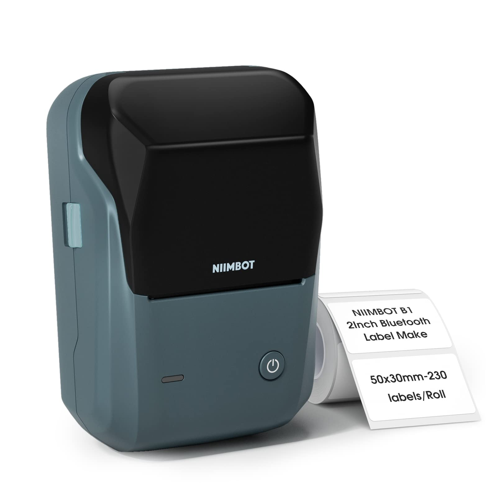
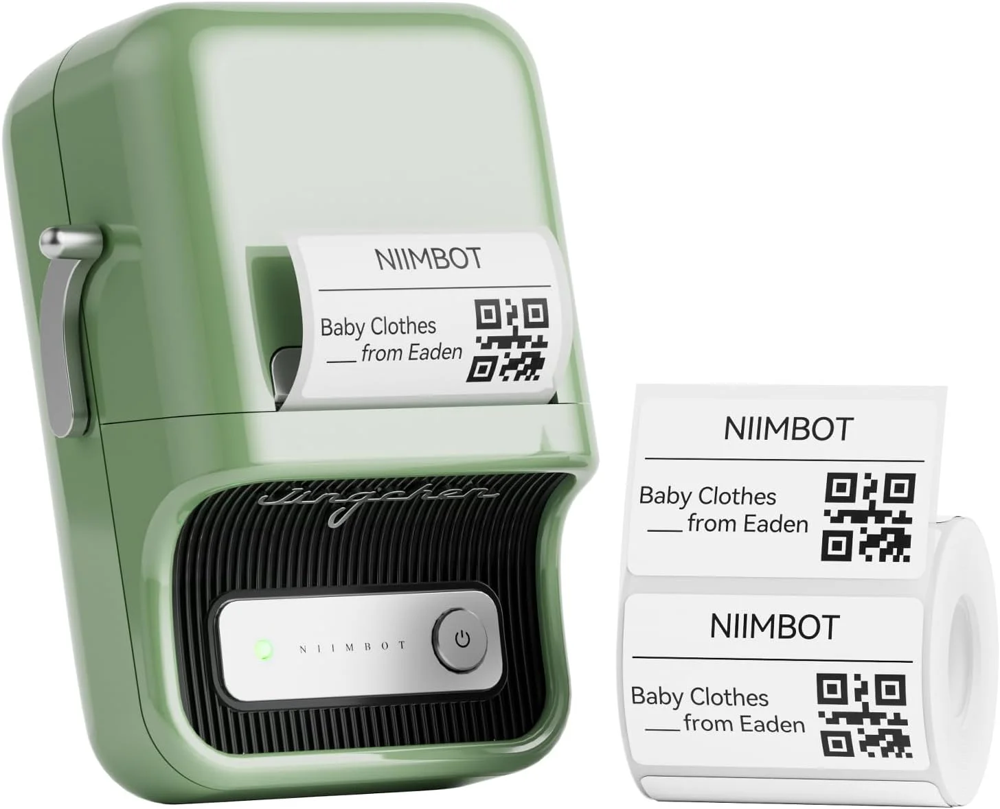
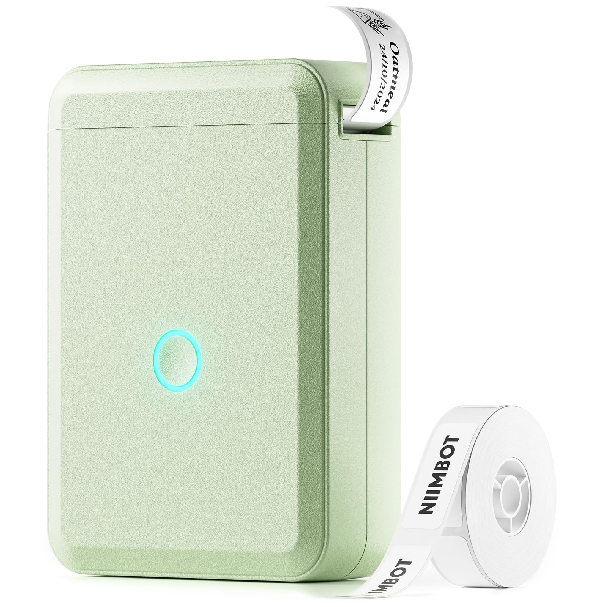

# hass-niimbot
Niimbot Label Printer Home Assistant Integration


| B1 | B21 Pro | D110 |
| :---: | :---: | :---: |
|  |  |  |


>[!IMPORTANT]
>
> For all NIIMBOT users using Bluetooth proxies:  
> Please update your proxy devices to **ESPHome 2025.11.2 or later**.
>
> **Benefits of updating:**
> - Much faster printing (almost instant)
> - Greatly improved reliability
> - Reduced delays thanks to improved internal GATT handling

## 💬 Feedback & Support

🐞 Found a bug? Let us know via an [Issue](https://github.com/eigger/hass-niimbot/issues).  
💡 Have a question or suggestion? Join the [Discussion](https://github.com/eigger/hass-niimbot/discussions)!


## Supported Models
- B1 (confirmed)
- B21 Pro (confirmed)
- D110 (confirmed)
- other models with Bluetooth may work

## Installation
1. Install this integration with HACS (adding repository required), or copy the contents of this
repository into the `custom_components/niimbot` directory.
2. Restart Home Assistant.
3. Go to Settings / Integrations and add integration "Niimbot"
4. Please select a discovered Niimbot device from the list.
   
## Examples for B1

```yaml
action: niimbot.print
data:
  payload:
    - type: text
      value: Hello World!
      font: ppb.ttf
      x: 100
      y: 100
      size: 40
    - type: barcode
      data: "12345"
      code: "code128"
      x: 100
      y: 100
    - type: icon
      value: account-cowboy-hat
      x: 60
      y: 120
      size: 120
    - type: dlimg
      url: "https://image url.png"
      x: 10
      y: 10
      xsize: 120
      ysize: 120
      rotate: 0
    - type: qrcode
      data: "qr data"
      eclevel: h # l, m, q, h - more info in docs https://pypi.org/project/qrcode/
      x: 140
      y: 50
      boxsize: 2
      border: 2
      color: "black"
      bgcolor: "white"
  width: 400
  height: 240
  rotate: 0
target:
  device_id: <your device>
```

## Example for D110

```yaml
action: niimbot.print
data:
  payload:
    - type: text
      value: "Hello World!"
      font: ppb.ttf
      x: 10
      "y": 10
      size: 30
  rotate: 90
  width: 240
  height: 96
target:
  device_id: <your device>
```

## Example for B21 Pro

```yaml
action: niimbot.print
data:
  payload:
    - type: rectangle
      x_start: 0
      x_end: 600
      y_start: 0
      y_end: 600
      fill: black
  width: 584 # maximum label width
  height: 354 # maximum label height
  density: 5 # use this density to get full use of the printer's resolution
target:
  area_id: kitchen
```

## Script example for multiline text with auto-fit

```yaml
alias: Print label with multiple lines of text
description: >-
  Use this tool to quick-print any label, for example a recipient label for
  mailing a letter.  Give the contents of the label, in multiple lines, in the
  `content` field, for the print to be successful.  The text will resize to fit
  the width, and the height will fit a maximum of five lines.
fields:
  contents:
    selector:
      text:
        multiline: true
    name: Contents
    required: true
    description: >-
      Contents of the label (e.g. the full address of a letter's recipient) each
      part in a separate line.
sequence:
  - action: niimbot.print
    data:
      payload:
        - type: new_multiline
          x: 0
          "y": 20
          size: 100 # start with a large font size
          width: 520
          height: 300
          fit: true
          font: rbm.ttf
          value: "{{ contents }}"
          # e.g.
          # value: |-
          #   Max Mustermann
          #   Strassenstraße 33
          #   49418 Mallorca
          #   Spain
      width: 584
      height: 350
      density: 5
    target:
      area_id: kitchen
```

In `type: new_multiline`, the font `size` starts by default at 20, and
the `spacing` between lines defaults to the font size.  You can, of
course, set your own custom font size and spacing.

If you specify `fit_width: True` or `fit: width` and add the required
specific `width` in pixels, the font `size` and `spacing` will be
iteratively reduced until the longest line in the text `value` you
specified fits the required width.

If you specify `fit_height: True` or `fit: height` and add the required
specific `height` in pixels, the font `size` and `spacing` will be
iteratively reduced until the whole text fits vertically in the supplied
height.

To combine both modes, you can specify `fit: True`.

Of course, if font `size` is left to its default, which is quite small
for 300x500mm labels, chances are, only very large amounts of text will
cause shrinkage of the font size to fit. In that case, pass a large font
`size` and it will be shrunk to a fitting size.

Note that the top part of letters in italicized text tends to spill outside
the specified width -- try to make your width slightly narrower in that case.

## Increasing print speed

The printer receives data from Home Assistant line by line.  When this data is
sent via a Bluetooth proxy, the latency involved in communicating each packet
and awaiting for a response can cause significant delays that add up.  This
is particularly notorious for complex labels with little to no empty horizontal
space.  This is so because that way of sending data is the maximally conservative
way that ensures maximum reliability.  That reliability comes at a cost of speed.

Despair not, as there are workarounds to accelerate printouts substantially.
In the developer console, you can try the following workarounds documented
below:

```yaml
action: niimbot.print
# We will assume a high-density printer like the B21 Pro.
data:
  payload:
    # Complex figure you can test with.
    - type: rectangle
      x_start: 0
      x_end: 10
      y_start: 0
      y_end: 600
      fill: black
  width: 584
  height: 350
  density: 5
  # The following value reduces the time HA waits between
  # lines sent to the printer, from its default 0.05 (50 ms).
  # Sufficiently small values may cause your printer to fail
  # to print at all, or print corrupted labels.
  wait_between_print_lines: 0.01
  # The following value changes the way that lines are sent
  # to the printer, from a write-with-response to a plain
  # fire-and-forget write, for the number of lines you set
  # minus one (in this example, the value says 16, so HA
  # would send 15 lines without confirmation, and send each
  # 16th line waiting for a response).  The default is 1,
  # which means every line gets sent using write-with-response,
  # which itself costs about 0.1 seconds per line.
  # Sufficiently large values will flood your ESPHome Bluetooth
  # proxies, causing no or partial printout of labels.
  print_line_batch_size: 16
target:
  device: <your device ID>
```

Once you have experimented with these configuration values, you can
set them permanently for every print.  Go to the *Devices & Services*
settings, then find *Niimbot* under the list of integrations, and
open it.  Use the gear icon for your printer's config entry to change
the settings to the values that worked for you:

* Wait time between print lines: set it to the value that worked
  for you, multiplied by 1000 (as the configuration value is in
  milliseconds).
* How often to confirm reception of print lines: set it to the
  value of `print_line_batch_size`.

Thus, the values that worked for you will now be permanent and used
in every print.

You are encouraged to open reports with the values that worked for you,
in order to help us come up with better, less conservative defaults.
Anecdotally, in a congested network, the B21 Pro printer is reliable
down to 10 milliseconds (0.01 seconds) of waiting between print lines,
and up to 16 lines in a batch prior to confirmation, which speeds up
complex labels more than *fourfold*.

## Previewing labels without consuming labels

The `niimbot.print` service supports *not printing*, if the data parameter
`preview` is present when you call it.

### Last label made image entity

You might think "but what is the point of just running a preview that
prints nothing?"

Think again.  An entity with ID `image.<your device>_last_label_made`
is updated every time you print or preview a label.  Stick it to
a dashboard of yours, and now you can always recall what label
you last made.

(Note that the label is not preserved between Home Assistant restarts.)

You can use this image entity to save consumables -- iterate on a label
design to perfect it (perhaps using the developer tools Actions tab),
without actually printing the label.

You could also have an automation that uses the image snapshot services
to take a snapshot of your label every time it changes.

If you don't want this entity, simply disable it from the entity settings.

Never waste a single sticker or label ever again!

### Scripting with the image data

If you call the `niimbot.print` service with the `response_variable`
set to some variable name, a `data:` string containing the generated
image (encoded as a URL) is returned to the calling script.

Here is a trivial example of how you could use this data:

* Ensure your Home Assistant instance has a `www` folder under its
  `/config` directory.
* Add the following code to your `configuration.yaml` (adjust the
  path to `www` to your setup).

```yaml
shell_command:
  update_label: >-
    bash -c 'set -o pipefail; echo "$0" | cut -d, -f2 | base64 -d >/config/www/label.png' {{ image_data }}
```

Now, every time you call the service `shell_command.update_label`,
with data parameter `image_data` set to the `data:` URL returned by
`niimbot.print`, the file `label.png` will be updated on disk inside
`www`.

* Add a *Local file* camera (via *Devices and Services -> Add Integration*)
  and when it asks you for the path, point it to `/config/www/label.png`.
  This "camera" entity will update automatically every time `label.png`
  is updated by anything.  Very neat!

* Create a script that will call `niimbot.print` and then `shell_command.update_label`
  in sequence.  Here is a sample that will prompt you for a payload (list of
  elements) and will then promptly preview such a payload into `label.png`:

```yaml
alias: Iterate on a label
description: ""
fields:
  payload:
    selector:
      object: {}
    default: []
    name: Payload
sequence:
  - action: niimbot.print
    target:
      device_id: 088a38fae16cef438c4c2592b0ac3c91
    data:
      payload: "{{ payload }}"
      width: 584
      height: 350
      density: 5
      preview: true
    response_variable: previewed
    alias: "\"Print\" a label to a data: image"
  - action: shell_command.update_label
    metadata: {}
    data:
      image_data: "{{ previewed.image }}"
    alias: Update label.png on disk
```

The grand finale?  Add a camera card to your dashboard:

```yaml
show_state: true
show_name: true
camera_view: auto
fit_mode: cover
type: picture-entity
# The following line contains the entity ID of my local file "camera".
entity: camera.local_file
```

## Custom Fonts
* https://github.com/OpenEPaperLink/Home_Assistant_Integration/blob/main/docs/drawcustom/supported_types.md#font-locations
* https://github.com/OpenEPaperLink/Home_Assistant_Integration/commit/4817d7d7b2138c31e3744a5f998751a17106037d

## References
- [MultiMote/nimblue](https://github.com/MultiMote/niimblue.git)
- [OpenEPaperLink](https://github.com/OpenEPaperLink/Home_Assistant_Integration.git)
