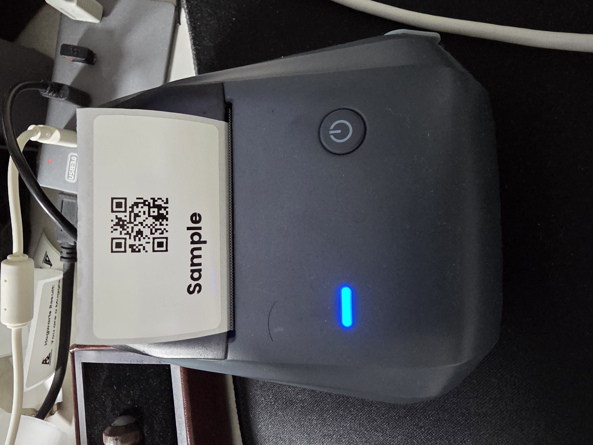

# Grocy Label Printing Integration

This configuration integrates Grocy label printing with Home Assistant (HA).

## Grocy Config (`config.php`)

Add the following lines to your Grocy configuration file (`config.php`) to enable the label printer webhook.
Replace `LABEL_PRINTER_WEBHOOK` with your Home Assistant webhook URL.

```php
Setting('LABEL_PRINTER_WEBHOOK', 'http://192.168.x.x:8123/api/webhook/-BTY2UEgCZ7WI99JwWYrr1YrS');
Setting('FEATURE_FLAG_LABEL_PRINTER', true);
```

## Home Assistant Automation

This YAML configuration sets up a Home Assistant automation that triggers when the webhook is called from Grocy and uses the Niimbot printer to print the label.
Make sure the `webhook_id` matches the end of the URL configured above.

```yaml
alias: Print Grocy Label
description: ""
triggers:
  - trigger: webhook
    allowed_methods:
      - POST
      - PUT
    local_only: true
    webhook_id: "-BTY2UEgCZ7WI99JwWYrr1YrS"
conditions: []
actions:
  - action: niimbot.print
    target:
      device_id: e12f0bc1c1822fbd384a59dfb5bd515a
    data:
      payload:
        - type: qrcode
          data: "{{ trigger.json.grocycode }}"
          x: 120
          "y": 30
          boxsize: 4
        - type: text
          value: "{{ trigger.json.product }}"
          x: 40
          "y": 170
          size: 40
      width: 400
      height: 240
      density: 3
mode: single
```

## Example Output

